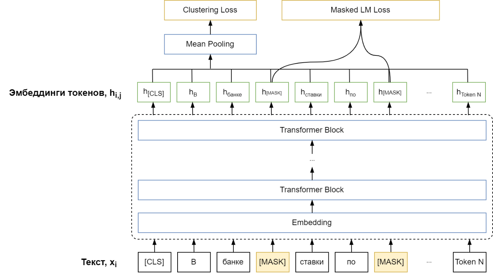
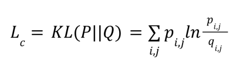
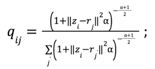
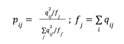
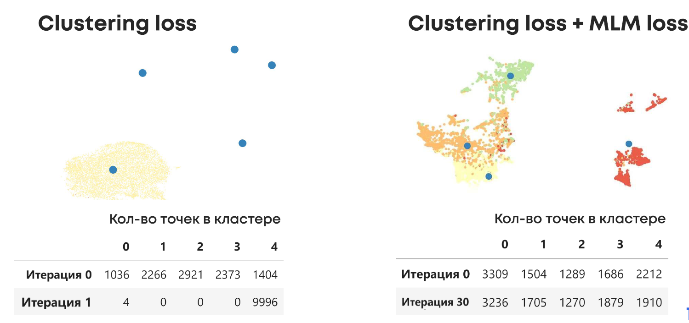

# BERT-Clustering
Realization of BERT Clustering on pytorch (https://aclanthology.org/2020.coling-main.482/) 

This model was independently reproduced in the text of the article ([link](https://aclanthology.org/2020.coling-main.482/)). In this model, two loss functions are used for training: Clustering Loss _Lc_, which is responsible for distributing texts across clusters and makes text embeddings more separable, and Masked LM Loss LM, which is responsible for adapting the model to the domain/vocabulary of the sample and acts as a regularizer for Clustering Loss.

Bert Clustering Architecture

Suppose we have a sample _X_ for training consisting of n documents. And we want to divide it into K clusters and train the cluster centers _rj_, where _j_ ∈ [1, K].

The clustering loss function _Lc_ is defined as the Kullback-Leibler distance between the actual distribution of document _xi_ over clusters _Q_ and the target distribution _P_

The coefficients _qij_ are defined as the smoothed normalized embedding distance of the document _zj_ to the cluster center _rj_, where is the smoothing coefficient. The closer the embedding _zi_ is located to the cluster _rj_, the greater the value of _qij_, там больше будет значение _q_ will_be there.

The target distribution of the document across clusters _P_ is derived from _Q_ according to the formulas below. This formula contributes to the purity of clusters, i.e. in _P_, compared to _Q_, even more emphasis will be placed on clusters with high qij. In addition, this formula prevents the formation of large clusters.

Cluster centroids are initialized as a result of clustering k-means by embeddings of _zi_ sentences _zi_ obtained using pre-trained BERT.

In the course of our experiments, we found that Clustering Loss alone is not enough. Masked LM Loss is important for the model to work. It is illustrated below that without Masked LM, the model becomes unstable and we have already experienced rapid cluster degeneracy in one epoch. In the case of MLM Loss, the model obtained significant clusters even after 30 epochs.

Drawing. Masked LM Loss is very important for model training. The results of clustering models with and without Masked LM Loss on random 10,000 messages from the Yelp dataset – a dataset of customer reviews and ratings from 1 to 5 stars-are shown.